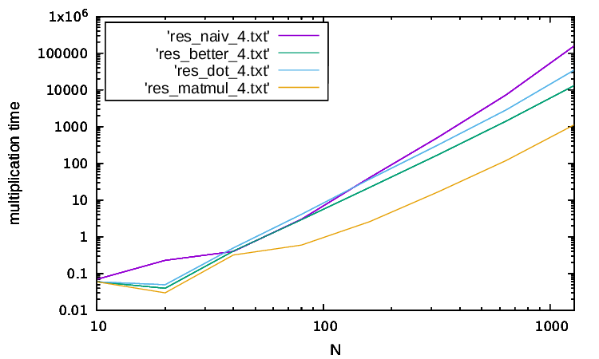
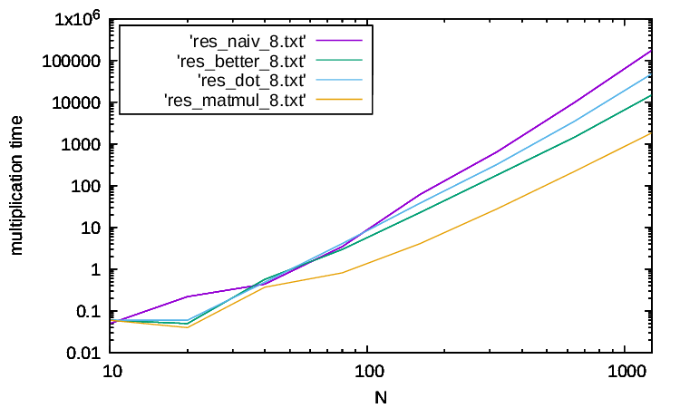
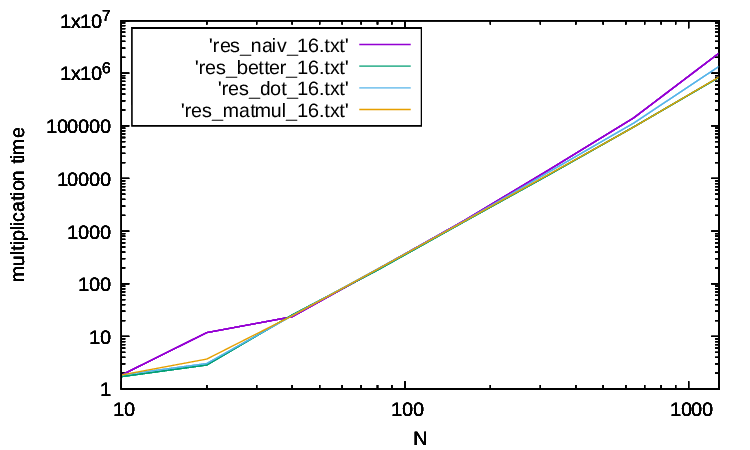

# Zadanie z Fortrana majace na celu porownanie szybkosci dzialan funkcji mnozacych macierze

## Organizacja plikow
W katalogu /src znajduje sie plik CMake oraz fragmety kodu napisenego w Fortranie: 
-3 moduly (naivemath.F90, bettermath.F90 i dotmath.F90) - kazdy z nich odpowiada za inny sposob mnozenia macierzy  
-program glowny (main.F90) - sprawdza i zapisuje do plikow tesktowych czasy wykonywania sie mnozenia macierzy (w zaleznosci od sposobu mnozenia i wielkosci macierzy) 

W katalogu /res znajduja sie: 
-pliki tekstowe z wynikami pomiarow utworzone przez program glowny (main.F90) 
-pliki pdf zawierajace wykresy pomiarow utworzone za pomaca programu gnuplot 

## Sposoby mnozenia
-naivmull - zwykle mnozenie macierzy, ktore przechodzi po wierszach macierzy 
-bettmull - to samo co naiv_mul tyle ze przechodzi po kolumnach macierzy (skuteczniejszy, poniewaz w Fortran-ie macierz przechowywana jest kolumnami 
-dotmull - podobnie jak naiv mul, tylko korzysta z wbudowanej funkcji dot_product, ktora sluzy do mnozenia skalarnego 2 wektorow 
-matmul - wbudowana funkcja, ktora sluzy do mnozenia 2 macierzy przez siebie 

## Wyniki
Ponizej widoczne sa wykresy (odpowiednio dla kind = 4, 8, 16) 

## Wnioski
Na pierwszych 2 (kind = 4 i kind = 8) wykresach wyraznie widac ze od pewnej wielkosci macierzy hierarchia szybkosci mnozenia reprezentuje sie tak (od najszybszego do najwolnieszego): 
-matmul 
-bettmull 
-dotmull 
-naivmull 
 
Na 3 wykresie (kind = 16) mozemy powiedziec o takiej samej hierarchii, ale z tym wyjatkiem, ze od pewnej wielkosci macierzy matmul i bettmull nachodza na siebie

## Sposoby mnozenia
-naivmull - zwykle mnozenie macierzy, ktore przechodzi po wierszach macierzy 
-bettmull - to samo co naiv_mul tyle ze przechodzi po kolumnach macierzy (skuteczniejszy, poniewaz w Fortran-ie macierz przechowywana jest kolumnami 
-dotmull - podobnie jak naiv mul, tylko korzysta z wbudowanej funkcji dot_product, ktora sluzy do mnozenia skalarnego 2 wektorow 
-matmul - wbudowana funkcja, ktora sluzy do mnozenia 2 macierzy przez siebie 

## Wyniki
Ponizej widoczne sa wykresy (odpowiednio dla kind = 4, 8, 16) 

## Wnioski
Na pierwszych 2 (kind = 4 i kind = 8) wykresach wyraznie widac ze od pewnej wielkosci macierzy hierarchia szybkosci mnozenia reprezentuje sie tak (od najszybszego do najwolnieszego): 
-matmul 
-bettmull 
-dotmull 
-naivmull 
 
Na 3 wykresie (kind = 16) mozemy powiedziec o takiej samej hierarchii, ale z tym wyjatkiem, ze od pewnej wielkosci macierzy matmul i bettmull nachodza na siebie
