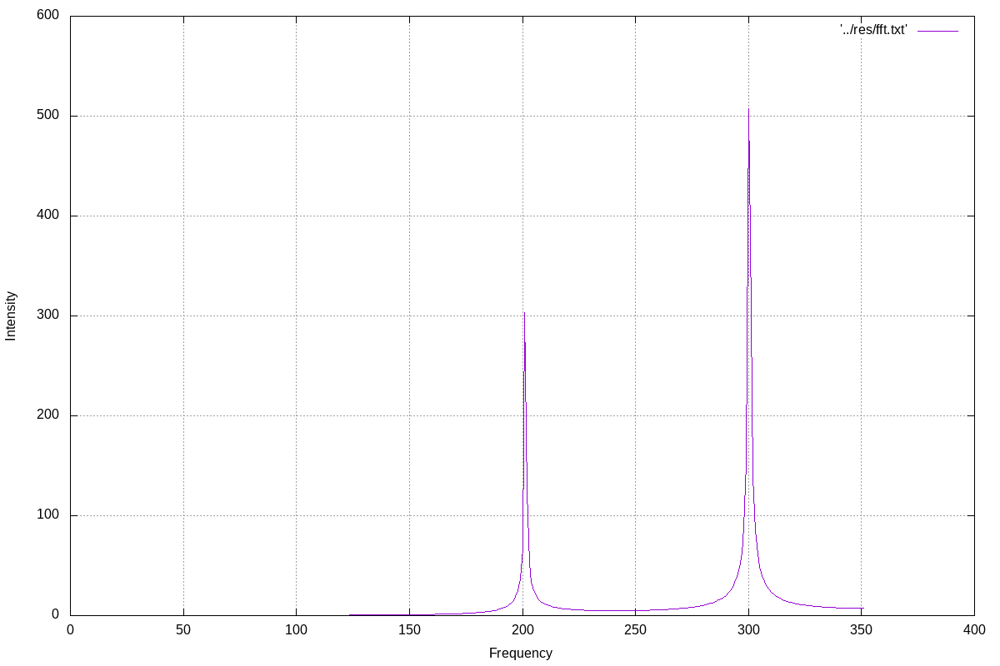
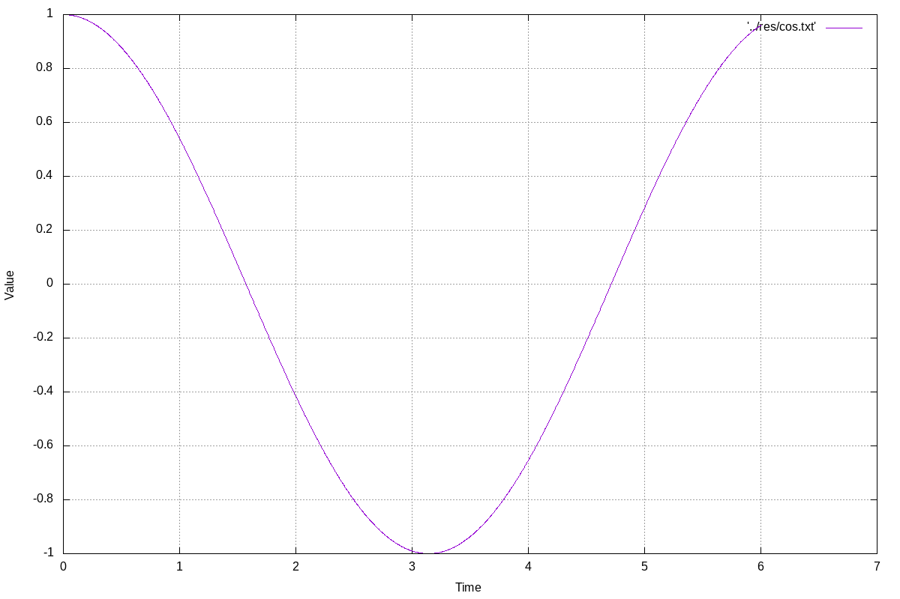
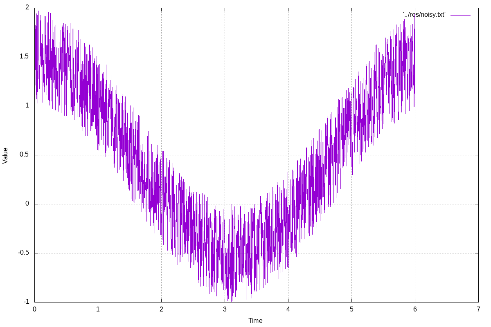
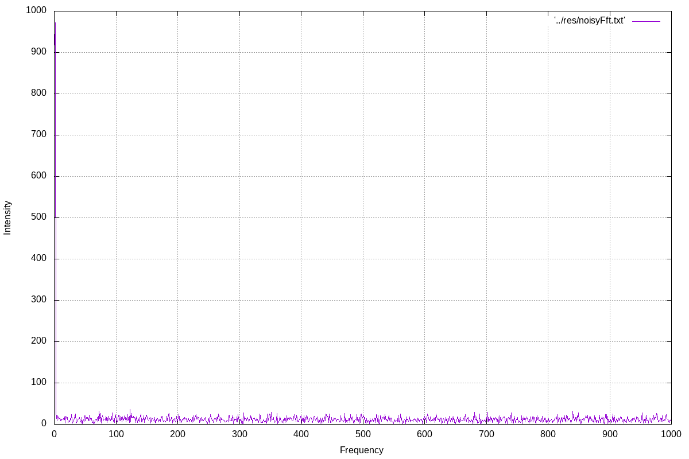
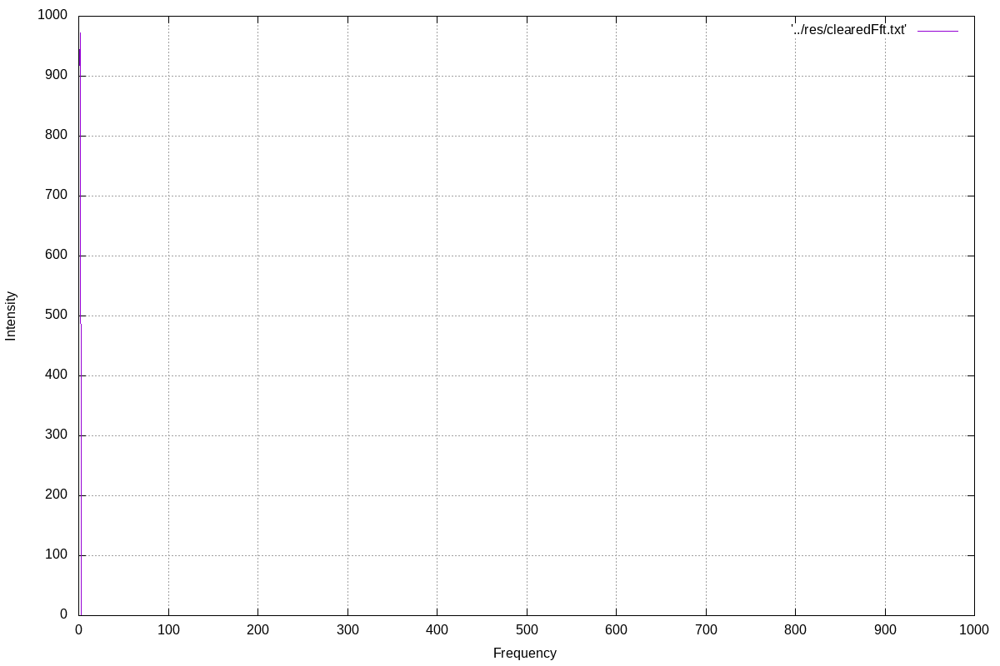
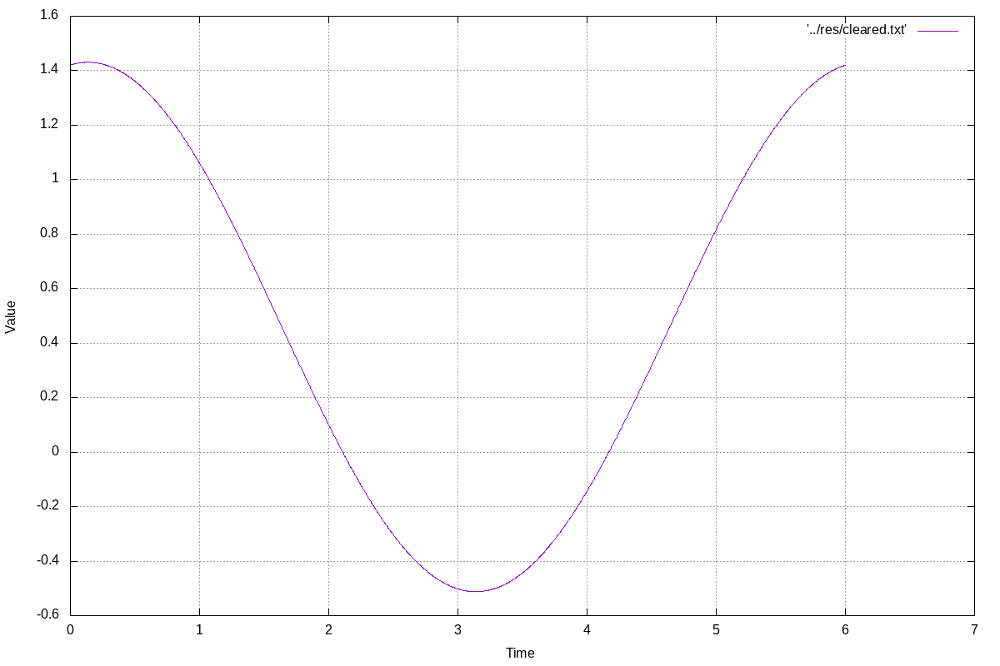

# Zadanie z Fortrana z szybkiej transformacji Fouriera

##Organizacja plikow

###Katalog /src
	- fftw3.f03 - plik biblioteczny, w ktorym zadeklarowane sa funkcje pomocne przy wykonywaniu fft
	- sumsignals.f90 - program, ktory sumuje ze soba funkcje sin(2*π*t*200) oraz 2*sin(2*π*t*400). Nastepnie program wykonuje fft na wczesniej otrzymanej sumie. W miedzyczasie program zapisuje do plikow tekstowych dane, na podstawie ktorych beda tworzone wykresy.
	- noiser.f90 - program, ktory zaburza sygnal cos(t) dodajac do niego losowa wartosc z zakresu od 0 do 1 i wykonuje na nim fft. Nastepnie pozbywa sie zaklocen poprzez wyzerowanie wszytskich wartosci, ktore wynosza ponizej 50. Na takich danych wykonywana jest odwrotna transformacja Fouriera. W miedzyczasie program zapisuje do plikow tekstowych dane, na podstawie ktorych beda tworzone wykresy.
	- gnuplot.sh - program, ktory tworzy wykresy w formacie png na podstawie wczesniej wygenerowanych danych.
	- Makefile - plik sluzacy do zbudowania projektu.

###Katalog /res
	- sum.txt - plik tekstowy zawierajacy wspolrzedne punktow sumy dwoch funkcji sinus
	- plot_sum.png - wykres odpowiadajacy danym z pliku sum.txt
	- fft.txt - plik tekstowy zawierajacy wspolrzedne punktow po przeprowadzaniu na powyzszej sumie fft
	- plot_fft.png - wykres odpowiadajacy danym z pliku fft.txt
	- cos.txt - plik tekstowy zawierajacy wspolrzedne punktow funkcji cosinus
	- plot_cos.png - wykres odpowiadajacy danym z pliku cos.txt
	- noisy.txt - plik tekstowy zawierajacy wspolrzedne punktow zaburzonego sygnalu cosinus
	- plot_noisy.png - wykres odpowiadajacy danym z pliku noisy.txt
	- noisyFft.txt - plik tekstowy zawierajacy wspolrzedne punktow po przeprowadzaniu fft na powyzszym sygnale
	- plot_noisyFft.png - wykres odpowiadajacy danym z pliku noisyFft.txt
	- clearedFft.txt - plik tekstowy zawierajacy wspolrzedne punktow po wyczyszczeniu sygnalu.
	- plot_clearedFft.png - wykres odpowiadajacy danym z pliku clearedFft.txt
	- cleared.txt - plik tekstowy zawierajacy wspolrzedne punktow po przeprowadzeniu odwrotnej transformacji Fouriera.
	- plot_cleared.png - wykres odpowiadajacy danym z pliku cleared.txt

###Wykonoanie programu
	Po kompilacji programu tworzone sa wszytskie pliki tekstowe i oraz wykresy:
plot_sum.png

plot_fft.png

plot_cos.png

plot_noisy.png

plot_noisyFft.png

plot_clearedFft.png

plot_cleared.png

###Wnioski
Dzieki fft i odwrotnej fft jestesmy wstanie odszumic sygnal i pozbyc sie wszystkich szumow. Nalezy pamietac o odpowiednim doborze czestosci probek sygnalu. 

