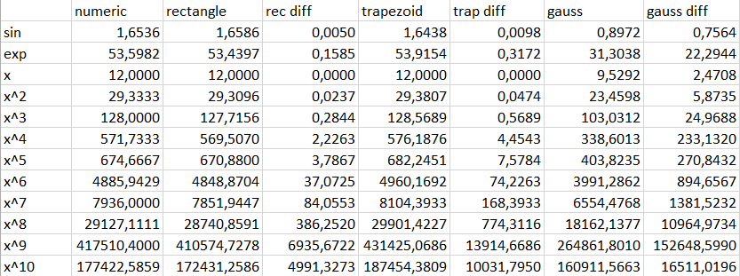

# Zadanie z Fortrana z funkcji calkujacych

## Organizacja plikow

### Katalog /src
 - functions.f90 - program, zawierajacy w sobie definicje funkcji, ktore beda calkowane  
 - integrate_functions.f90 - modul, ktory zawiera definicje funkcji calkujacych  
 - main.f90 - program, ktory wykonuje funkcje calkujace zdefiniowane w integrate_functions.f90 na funkcjach z functions.f90. W miedzyczasie program zapisuje do plikow tekstowych wyniki tych operacji. Program korzysta z coarrays, aby wykonywac obliczenia wspolbieznie. 
 - Makefile - plik sluzacy do zbudowania projektu. 

### Katalog /res
 - gauss_res.txt - wyniki calkowania gaussa 
  - rectangle_res.txt - wyniki calkowania metoda prostokatow 
 - trapezoid_res.txt - wyniki calkowania metoda trapezow 
 - table.png - tabela zawierajaca wszystkie wyniki calkowania wraz z roznica miedzy nimi a wynikiem calki numerycznej (numeric) 

### Wykonanie programu
Po kompilacji programu tworzone sa wszytskie pliki tekstowe. 

Nastepnie na ich podstawie zrealizowalem tabele: 
**table.png** 

 

### Wnioski
Metoda prostokatow dala lepsze rezultaty od metody trapezow. Wyniki calkowania metoda Gaussa daly bardzo niedokladne rezultaty - mozliwe ze jest to blad implementacji, lecz nie umialem go znalezc.